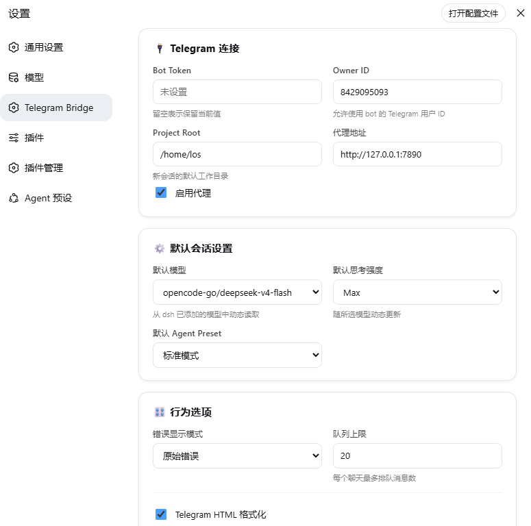

# dsh-telegram-bridge

[English](./README.en.md) | **中文**

将 Telegram 私聊与 [DeepSeek Harness](https://github.com/deepseek-ai/deepseek-harness)（`dsh`）Agent 会话连接起来的桥接插件。

直接在 Telegram 里和你的 dsh Agent 对话：发送消息、接收回复、切换模型、调整思考强度、选择 Agent preset、管理上下文——全部在私聊中完成。

> 当前版本：**v1.1.2** · 本项目持续更新中..

## 功能特性

- 💬 **私聊桥接**：Telegram 与 dsh Agent 会话的一对一对话。
- 🧠 **模型与思考强度控制**：动态列出并切换模型和思考强度。
- 🎛️ **Agent preset 切换**：选择可用的 dsh preset（仅限空白会话）。
- 📋 **内联命令菜单**：新对话、打断、状态、设置、会话等快捷按钮；也提供聊天内命令菜单 `/commands` 作为原生菜单不可见时的兜底。
- 🔄 **快捷操作**：最终回复附带重新生成、打断、新对话、菜单四键；每条失败消息可独立重试。
- 📂 **轻量多会话**：每个聊天保留最近 N 个会话，支持 `/sessions` 切换，每个会话独立保存模型/预设设置。
- ⏳ **实时状态行**：Agent 思考、调用工具、多步骤进度、超时耗时都会在单条状态消息中实时更新。
- 🎛️ **结构化回复渲染**：支持 dsh-ui 的 keyvalue、callout、list、steps、table、todo、section；普通文字支持加粗、斜体、标题、列表、引用。
- 🧵 **队列与打断**：消息按顺序排队，带队列上限；`/interrupt` 打断当前任务并清空队列（`/cancel` 仍可用）。
- 🗜️ **上下文压缩**：`/compact` 压缩过长的对话历史。
- 🧹 **安全消息格式**：HTML 转义、代码块识别、按逻辑边界分段发送；超长代码块自动截断。
- 📊 **增强状态**：`/status` 显示忙碌状态、provider/model、消息数与 token 统计、preset 锁定状态。
- 🩺 **健康检查**：`/health` 显示运行时长、消息数、回复数、错误数。
- ♻️ **状态持久化**：chat → session 映射和用户设置会在 dsh 重启后保留。
- 🌐 **代理支持**：自动使用 `HTTPS_PROXY` / `HTTP_PROXY`。
- 🛡️ **仅限 Owner**：只有配置的 Telegram 用户 ID 可以使用。
- 🖥️ **dsh Web UI 设置面板**：在 dsh Web 设置页中管理 Bot Token、Owner、代理、默认模型/Preset、队列上限等；默认模型和思考强度从 dsh 动态读取。

## 设置面板

dsh Web UI 设置页中提供了 **Telegram Bridge** 独立分区，可直接管理连接、默认模型/Preset 和行为选项。



## 工作原理

```text
Telegram Bot API
      │ 长轮询（grammY）
      ▼
dsh-telegram-bridge（dsh profile 插件）
      │
      ├── dsh apiProxy（session、模型、preset）
      ├── dsh agents（取消任务）
      └── dsh session 事件（Agent 回复）
      │
      ▼
dsh Agent 会话
```

插件运行在 dsh profile 内部（通常是 `web`），直接使用 dsh 原生服务，不需要独立服务器或 Webhook。

## 环境要求

- 已安装 DeepSeek Harness（`dsh`）
- 已安装 `pnpm`（dsh 插件管理器依赖）
- 来自 [@BotFather](https://t.me/BotFather) 的 Telegram Bot Token
- 你的 Telegram 数字 User ID（可通过 [@userinfobot](https://t.me/userinfobot) 查询）

## 安装

可以通过以下命令安装：

```bash
dsh plugin --profile web add github:JxaMe/dsh-telegram-bridge
```

本地开发安装：

```bash
cd ~/Projects/dsh-telegram-bridge
pnpm install
pnpm build
dsh plugin --profile web add /home/los/Projects/dsh-telegram-bridge
```

验证插件是否注册成功：

```bash
dsh --profile web --dump-config | grep dsh-telegram-bridge
```

然后重启 `dsh web`。

## 稳定性

- **日志文件**：`~/.dsh/dsh-telegram-bridge/logs/dsh-telegram-bridge.log`，超过 5MB 自动轮转
- **状态备份**：`state.json.bak` / `settings.json.bak`，主文件损坏时自动回退恢复
- **全局兜底**：未捕获的 Promise rejection / 异常会写入日志并尽量不中断运行
- **启动自检**：启动时检查 Telegram API（`getMe`）与 dsh API（`agentPresets.list`），失败会写入日志
- **状态行保活**：长任务期间状态行每 3 秒轮换文案，并在有工具调用时显示工具名
- **队列持久化**：排队消息写入 `queue.json`，dsh 重启后自动恢复继续处理
- **限流保护**：Telegram 429 限流自动等待后重试
- **孤儿清理**：超过 7 天未活跃的会话自动移出列表（不删除 dsh session）

## 配置


创建或编辑 `~/.dsh/dsh-telegram-bridge/config.json`：

```json
{
  "botToken": "123456:ABC-YOUR-REAL-BOT-TOKEN",
  "ownerId": 123456789,
  "projectRoot": "/home/you"
}
```

| 字段 | 说明 |
|---|---|
| `botToken` | 来自 @BotFather 的 Telegram Bot Token |
| `ownerId` | 你的 Telegram 数字 User ID |
| `projectRoot` | 新 dsh session 使用的工作目录 |

> 插件首次启动时会自动生成示例配置文件。

## 使用方法

打开与 bot 的私聊，发送 `/start`。

### 命令

| 命令 | 说明 |
|---|---|
| `/start` | 显示主菜单 |
| `/new` | 开始新对话（需要确认） |
| `/interrupt` | 打断当前任务并清空队列（`/cancel` 仍可用） |
| `/status` | 查看 session、队列、模型和 preset 状态 |
| `/menu` | 打开设置面板 |
| `/sessions` | 查看和切换最近会话 |
| `/compact` | 压缩对话历史 |
| `/version` | 查看当前版本与更新 |
| `/help` | 显示命令帮助 |
| `/commands` | 打开聊天内命令菜单 |

### 设置面板

使用 `/menu` 可以：

- 切换**模型**
- 切换**思考强度**
- 切换 **Agent preset**（仅限空白/新会话）

## 开发

```bash
pnpm install
pnpm typecheck
pnpm build
pnpm test
```

### 项目结构

```text
dsh-telegram-bridge/
├── src/
│   ├── index.ts          # dsh 插件入口
│   ├── telegram.ts       # Telegram bot 与处理器
│   ├── session.ts        # dsh session 管理
│   ├── queue.ts          # 消息队列
│   ├── forwarder.ts      # Agent 回复转发
│   ├── settings.ts       # 模型/思考强度/preset 设置
│   ├── state.ts          # 持久化状态
│   ├── config.ts         # 配置加载
│   ├── proxy-fetch.ts    # Telegram API 代理支持
│   ├── callback.ts       # Telegram 回调数据编解码
│   ├── security.ts       # 日志脱敏
│   └── ...
├── extensions/dsh/       # dsh bundle patch
└── docs/aegis/           # Aegis 设计与计划文档
```

## Roadmap

- [x] V2：在 dsh Web UI 中增加完整设置面板（基础版已上线）

## License

[MIT](./LICENSE)
